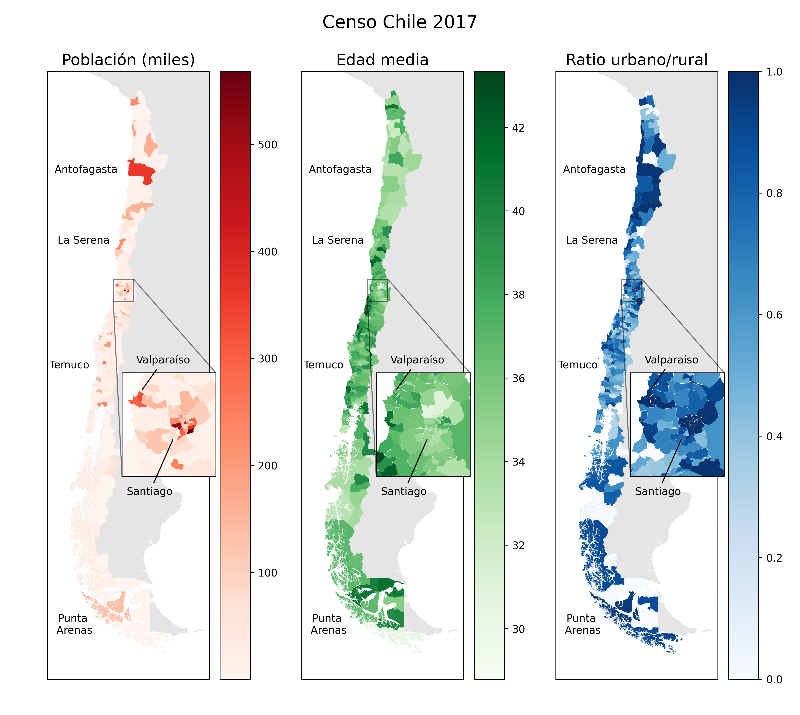

# Data visualization of 2017 Chile Census

Simple project using Python and **geopandas** to display some data from the 2017 Chile Census. In particular, in this script I show the:
- Population
- Mean age
- Urban/rural population ratio
of each of the 346 communes of Chile.

The code can be easily modified to visualize other data from the census files.

**Output:**

## Sources
- 2017 Chile Census data: http://resultados.censo2017.cl/
- Territorial division of Chile (GeoJSON), adapted from Biblioteca del Congreso de Chile by [@fcortes](https://github.com/fcortes/): https://github.com/fcortes/Chile-GeoJSON
- NaturalEarth map: https://www.naturalearthdata.com/downloads/10m-cultural-vectors/
